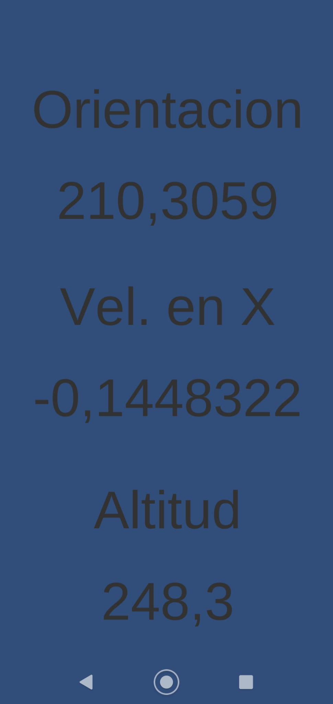

# SensoresUnity_CristianRodriguezNavarro

En el projecto final he hecho uso de los 3 sensores, mostrando la orientacion, la velocidad en x y la altitud.  
  
```c#
public class Shoot : MonoBehaviour
{
    [SerializeField] Text or;
    [SerializeField] Text vel;
    [SerializeField] Text alt;

    void Start()
    {
        Input.compass.enabled = true;
        Input.location.Start();

    }

    void Update()
    {  
         or.text = Input.compass.trueHeading.ToString();
         vel.text = Input.acceleration.x.ToString();
         alt.text = Input.location.lastData.altitude.ToString();
    }


}
```

Activo el compás y empiezo el proceso de la localización y simplemente en cada frame actualizo los valroes previamente comentados.  
  
El resultado final es este  
  

